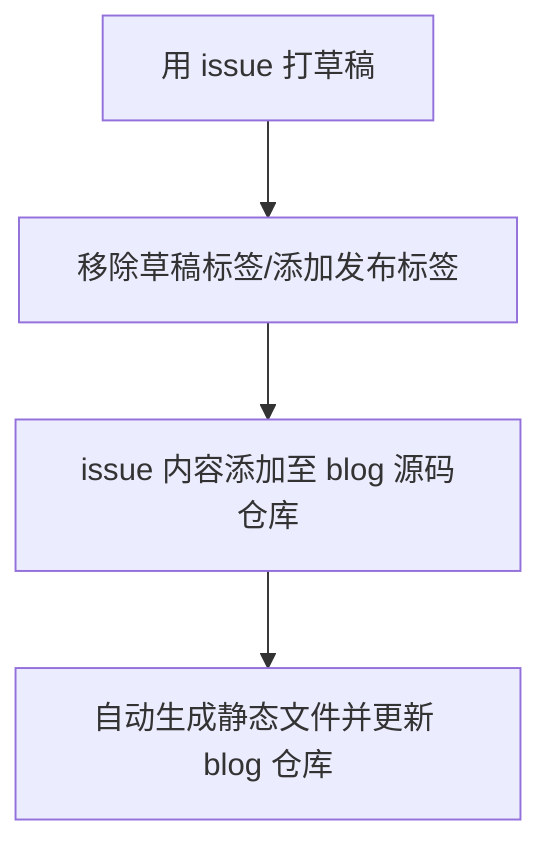

# [issues 作为草稿箱](https://github.com/wjianbo/blog-data/issues/1)

blog 实现了自动部署，又纠结起写作工具。手机上喜欢用熊掌记，但是要上传到 GitHub 仓库还是有些麻烦，于是又想起 GitHub issues。受 [yihong](https://github.com/yihong0618) 的[开源博客](https://github.com/yihong0618/gitblog/issues/177)启发，想到如下的更新流程：

