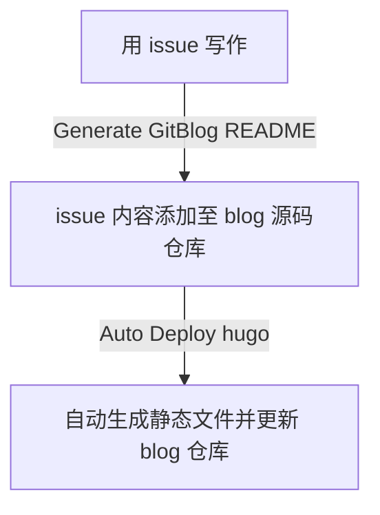

blog 实现了自动部署，又纠结起写作工具。手机上喜欢用熊掌记，但是上传发布还是有些麻烦，于是又想起 issues。受 [yihong](https://github.com/yihong0618) 的[开源博客](https://github.com/yihong0618/gitblog/issues/177)启发，想到如下的更新流程：

一共用到 2 个 action：
- Generate GitBlog README 是在 yihong 的基础上略作修改
- Auto Deploy hugo 是照这篇[知乎文章](https://zhuanlan.zhihu.com/p/403221054)做的

相关代码在我的 [blog-data 仓库](https://github.com/wjianbo/blog-data)里都可以找到，欢迎参考。

※ 用 issues 写作的想法最早来自[这篇文章](https://io-oi.me/tech/continuous-writing-with-github-issues/)。